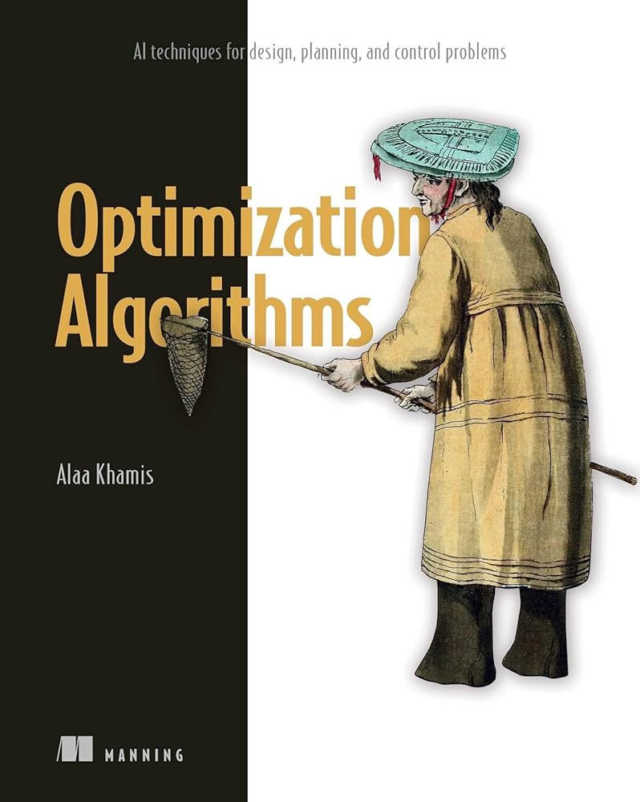

# Optimization Algorithms: AI techniques for design, planning, and control problems

This book is written for practitioners interested in solving ill-structured search and optimization problems using modern derivative-free algorithms. It will get you up to speed with the core concepts of search and optimization and endow you with the ability to handle practical design, planning and control problems.

Without assuming any prior knowledge of search and optimization, and with only an intermediate knowledge of data structures and Python, this book is designed to take anyone from never having solved search and optimization problems to being a well-rounded practitioner. You will be able to select, implement, and adapt the right solver for the right problem.

# Table of Contents

* **Part-I Deterministic Search Algorithms**
  * [Chapter-1 Introduction to search and optimization](https://github.com/search-and-optimization/book/tree/main/Chapter%201)
  * [Chapter 2. A deeper look at search and optimization](https://github.com/search-and-optimization/book/tree/main/Chapter%202)
  * [Chapter 3. Blind search algorithms](https://github.com/search-and-optimization/book/tree/main/Chapter%203)
  * [Chapter 4. Informed search algorithms](https://github.com/search-and-optimization/book/tree/main/Chapter%204)
* **Part-II Trajectory-based Algorithms**
  * [Chapter 5. Simulated annealing](https://github.com/search-and-optimization/book/tree/main/Chapter%205)
  * [Chapter 6. Tabu search](https://github.com/search-and-optimization/book/tree/main/Chapter%206)
* **Part-III Evolutionary Computing Algorithms**
  * [Chapter 7. Genetic algorithms](https://github.com/search-and-optimization/book/tree/main/Chapter%207)
  * [Chapter 8. Genetic algorithm variants](https://github.com/search-and-optimization/book/tree/main/Chapter%208)
* **Part-IV Swarm Intelligence Algorithms**
  * [Chapter 9. Particle swarm optimization](https://github.com/search-and-optimization/book/tree/main/Chapter%209)
  * [Chapter 10. Other Swarm intelligence algorithms to explore](https://github.com/search-and-optimization/book/tree/main/Chapter%2010)
* **Part-V Machine Learning-based Methods**
  * [Chapter 11. Supervised and unsupervised learning](https://github.com/search-and-optimization/book/tree/main/Chapter%2011)
  * [Chapter 12. Reinforcement learning](https://github.com/search-and-optimization/book/tree/main/Chapter%2012)          
* **Appendices**
  * [Appendix-A Search and optimization libraries in Python](https://github.com/search-and-optimization/book/tree/main/Appendix%20A)
  * [Appendix-B Benchmarks and datasets](https://github.com/search-and-optimization/book/tree/main/Appendix%20B)
  * [Appendix-C Exercises and solutions](https://github.com/search-and-optimization/book/tree/main/Appendix%20C)

<a href="https://www.manning.com/books/optimization-algorithms">
</a>

# Note

If you dowbloaded the code bundle from the Manning website, please consider checking out the official code repository on GitHub at: https://github.com/Optimization-Algorithms-Book/Code-Listings for the most recent version.

# Errata

You can find errata for the book [here](https://github.com/Optimization-Algorithms-Book/Code-Listings/blob/main/errata.md).

# Video Summary

<iframe width="560" height="315" src="https://www.youtube.com/embed/RAVFSvgks3Q?si=X72cbFzKTlQPD-Fn" title="YouTube video player" frameborder="0" allow="accelerometer; autoplay; clipboard-write; encrypted-media; gyroscope; picture-in-picture; web-share" referrerpolicy="strict-origin-when-cross-origin" allowfullscreen></iframe>


# Reviews

> "*Elegantly covers modern optimization algorithms in depth and breadth. A great resource.*"
>    
> **Ajit Jaokar** - Course Director at [University of Oxford](https://www.conted.ox.ac.uk/tutors/4164)

---

> "*A treasure trove. Perfect for anyone looking to navigate the intricate world of optimization in real-world scenarios.*"
>
> **Sergei Kalinin** - Weston Fulton Professor at [University of Tennessee](https://tickle.utk.edu/mse/faculty/sergei-kalinin/)

---

> "*An exceptional book on the most prominent optimization algorithms.*"
>
> **Maxim Volgin** - Data Scientist at [KLM Royal Dutch Airlines](https://nl.linkedin.com/in/maxvol)

---

> "*This little gem introduces the reader to the algorithms and how you should apply them to real-world problems. A must-read!*"
>
> **Marcello La Rocca** - Author of [Grokking Data Structures and Advanced Algorithms and Data Structures](https://github.com/mlarocca)

---

# Citation

Plain text (IEEE style):

Alaa Khamis. <i>Optimization Algorithms: AI techniques for design, planning, and control problems</i>. Manning Publications, ISBN 978-1633438835, 2024.

BibTeX:
```
@book{Khamis2024,
  title = {Optimization Algorithms: AI techniques for design, planning, and control problems},
  author  = {Alaa Khamis},
  year  = {2024},
  isbn  = {ISBN 978-1633438835},
  publisher = {Manning Publications}
}
```