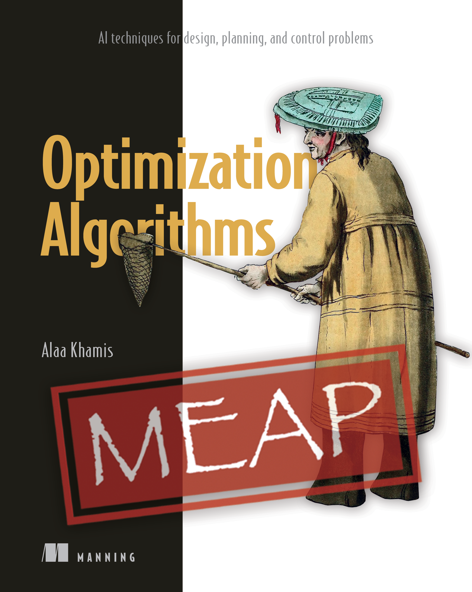

# Optimization Algorithms: AI techniques for design, planning, and control problems

Code Listings for the book: Optimization Algorithms:Optimization Algorithms: AI techniques for design, planning, and control problems. Manning Publications, 2023.

Optimization problems are ubiquitous in different aspects of life. This book is written for practitioners interested in solving ill-structured search and optimization problems using modern derivative-free algorithms. The book will get you up to speed with the core concepts of search and optimization and endow you with the ability to deal with practical design, planning and control problems.

Without assuming any prior knowledge of search and optimization and with an intermediate knowledge of data structures and Python, this book has been written to take most anyone from never solving search and optimization problems to being a well-rounded search and optimization practitioner able to select, implement and adapt the right solver for the right problem.

# Table of Contents

* [Chapter-1 Introduction to Search and Optimization](https://github.com/search-and-optimization/book/tree/main/Chapter%201)
* **Part-I Deterministic Seach Algorithms**
  * [Chapter 2. A Deeper Look at Search and Optimization](https://github.com/search-and-optimization/book/tree/main/Chapter%202)
  * [Chapter 3. Blind Search Algorithms](https://github.com/search-and-optimization/book/tree/main/Chapter%203)
  * [Chapter 4. Informed Search Algorithms](https://github.com/search-and-optimization/book/tree/main/Chapter%204)
* **Part-II Trajectory-based Algorithms**
  * [Chapter 5. Simulated Annealing](https://github.com/search-and-optimization/book/tree/main/Chapter%205)
  * [Chapter 6. Tabu Search](https://github.com/search-and-optimization/book/tree/main/Chapter%206)
* **Part-III Evolutionary Computing Algorithms**
  * [Chapter 7. Genetic Algorithms](https://github.com/search-and-optimization/book/tree/main/Chapter%207)
  * [Chapter 8. Genetic Algorithm Variants](https://github.com/search-and-optimization/book/tree/main/Chapter%208)
* **Part-IV Swarm Intelligence Algorithms**
  * [Chapter 9. Particle Swarm Optimization](https://github.com/search-and-optimization/book/tree/main/Chapter%209)
  * [Chapter 10. Other SI Algorithms to Explore](https://github.com/search-and-optimization/book/tree/main/Chapter%2010)
* **Part-V Machine Learning-based Methods**
  * [Chapter 11. Supervised and Unsupervised Learning](https://github.com/search-and-optimization/book/tree/main/Chapter%2011)
  * [Chapter 12. Reinforcement Learning](https://github.com/search-and-optimization/book/tree/main/Chapter%2012)          
* **Appendices**
  * [Appendix-A Search and Optimization Libraries in Python](https://github.com/search-and-optimization/book/tree/main/Appendix%20A)
  * [Appendix-B Benchmarks and Datasets](https://github.com/search-and-optimization/book/tree/main/Appendix%20B)
  * [Appendix-C Solutions to Exercises](https://github.com/search-and-optimization/book/tree/main/Appendix%20C)

<h2 tabindex="-1" id="user-content-citation" dir="auto"><a class="heading-link" href="#citation">Citation<svg class="octicon octicon-link" viewBox="0 0 16 16" version="1.1" width="16" height="16" aria-hidden="true"><path d="m7.775 3.275 1.25-1.25a3.5 3.5 0 1 1 4.95 4.95l-2.5 2.5a3.5 3.5 0 0 1-4.95 0 .751.751 0 0 1 .018-1.042.751.751 0 0 1 1.042-.018 1.998 1.998 0 0 0 2.83 0l2.5-2.5a2.002 2.002 0 0 0-2.83-2.83l-1.25 1.25a.751.751 0 0 1-1.042-.018.751.751 0 0 1-.018-1.042Zm-4.69 9.64a1.998 1.998 0 0 0 2.83 0l1.25-1.25a.751.751 0 0 1 1.042.018.751.751 0 0 1 .018 1.042l-1.25 1.25a3.5 3.5 0 1 1-4.95-4.95l2.5-2.5a3.5 3.5 0 0 1 4.95 0 .751.751 0 0 1-.018 1.042.751.751 0 0 1-1.042.018 1.998 1.998 0 0 0-2.83 0l-2.5 2.5a1.998 1.998 0 0 0 0 2.83Z"></path></svg></a></h2>
<h4 tabindex="-1" id="user-content-plain-text-chicago-style" dir="auto"><a class="heading-link" href="#plain-text-chicago-style">Plain text (IEEE style):<svg class="octicon octicon-link" viewBox="0 0 16 16" version="1.1" width="16" height="16" aria-hidden="true"><path d="m7.775 3.275 1.25-1.25a3.5 3.5 0 1 1 4.95 4.95l-2.5 2.5a3.5 3.5 0 0 1-4.95 0 .751.751 0 0 1 .018-1.042.751.751 0 0 1 1.042-.018 1.998 1.998 0 0 0 2.83 0l2.5-2.5a2.002 2.002 0 0 0-2.83-2.83l-1.25 1.25a.751.751 0 0 1-1.042-.018.751.751 0 0 1-.018-1.042Zm-4.69 9.64a1.998 1.998 0 0 0 2.83 0l1.25-1.25a.751.751 0 0 1 1.042.018.751.751 0 0 1 .018 1.042l-1.25 1.25a3.5 3.5 0 1 1-4.95-4.95l2.5-2.5a3.5 3.5 0 0 1 4.95 0 .751.751 0 0 1-.018 1.042.751.751 0 0 1-1.042.018 1.998 1.998 0 0 0-2.83 0l-2.5 2.5a1.998 1.998 0 0 0 0 2.83Z"></path></svg></a></h4>

Alaa Khamis. <i>Optimization Algorithms: AI techniques for design, planning, and control problems</i>. Manning Publications, ISBN 9781633438835, 2023.

<h4 tabindex="-1" id="user-content-bibtex" dir="auto"><a class="heading-link" href="#bibtex">BibTeX:<svg class="octicon octicon-link" viewBox="0 0 16 16" version="1.1" width="16" height="16" aria-hidden="true"><path d="m7.775 3.275 1.25-1.25a3.5 3.5 0 1 1 4.95 4.95l-2.5 2.5a3.5 3.5 0 0 1-4.95 0 .751.751 0 0 1 .018-1.042.751.751 0 0 1 1.042-.018 1.998 1.998 0 0 0 2.83 0l2.5-2.5a2.002 2.002 0 0 0-2.83-2.83l-1.25 1.25a.751.751 0 0 1-1.042-.018.751.751 0 0 1-.018-1.042Zm-4.69 9.64a1.998 1.998 0 0 0 2.83 0l1.25-1.25a.751.751 0 0 1 1.042.018.751.751 0 0 1 .018 1.042l-1.25 1.25a3.5 3.5 0 1 1-4.95-4.95l2.5-2.5a3.5 3.5 0 0 1 4.95 0 .751.751 0 0 1-.018 1.042.751.751 0 0 1-1.042.018 1.998 1.998 0 0 0-2.83 0l-2.5 2.5a1.998 1.998 0 0 0 0 2.83Z"></path></svg></a></h4>

<pre class="notranslate"><code>@book{Khamis2023,
  title     = "Optimization Algorithms: AI techniques for design, planning, and control problems",
  author    = "Alaa Khamis",
  year      = 2023,
  publisher = "Manning",
  address   = "Shelter Island, NY"
}
</code></pre>

